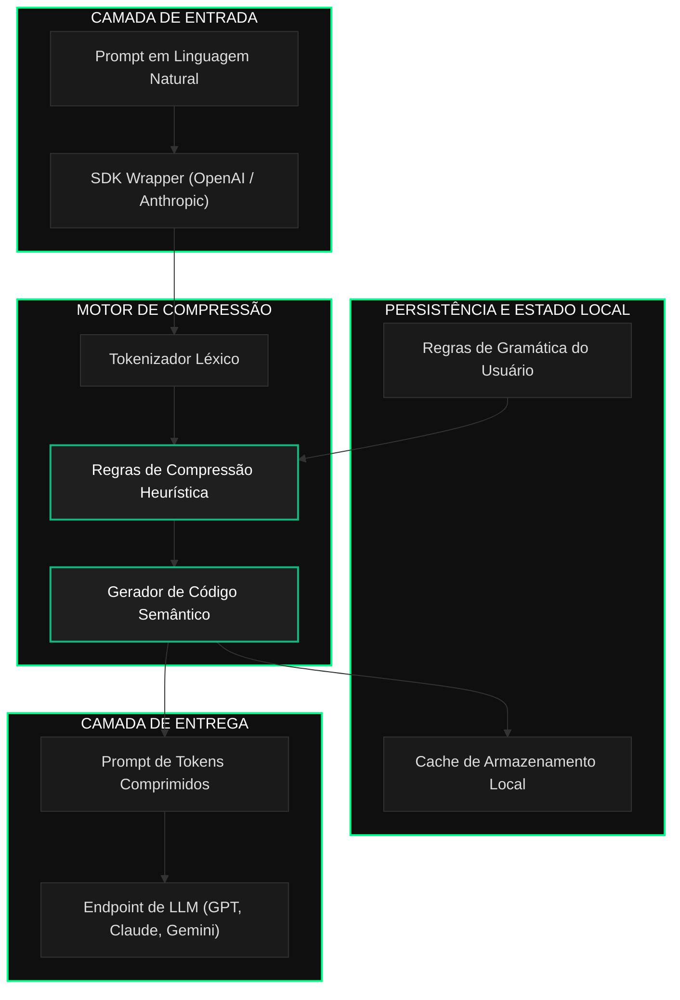
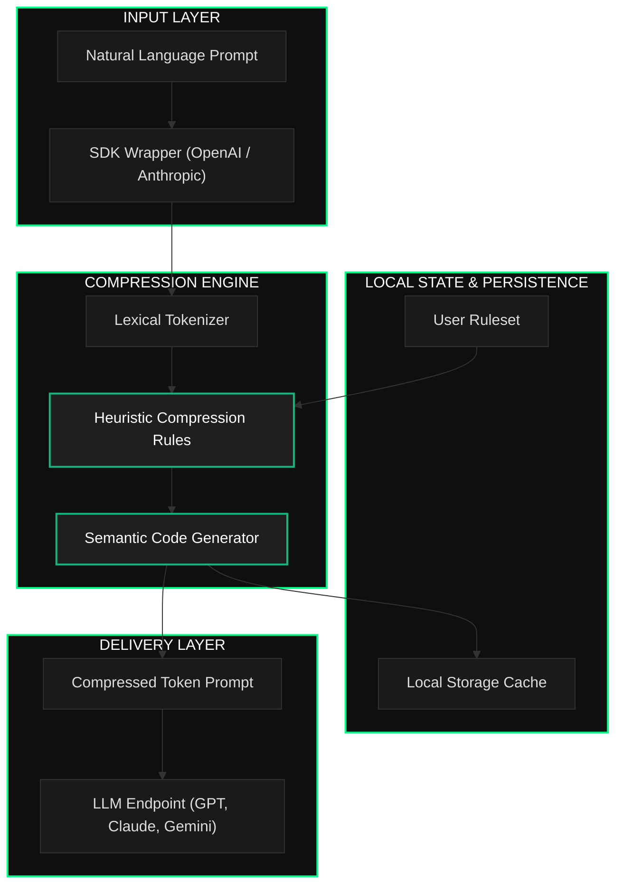

# TokLang

[Português](#português) | [English](#english)

---

<a name="português"></a>
## Português

> **O Middleware de Compressão Semântica de Prompts para a Era da IA**
> *Reduza o consumo de tokens de LLMs em até 85% com zero dependências, zero latência e privacidade absoluta.*

### O que é TokLang?

TokLang é um middleware de compressão semântica de prompts projetado para executar localmente com latência zero. Ele atua como uma camada intermediária entre a entrada humana e os Modelos de Linguagem de Grande Porte (LLMs), compactando prompts de linguagem natural em tokens de alta densidade em tempo real.

Diferente de outras ferramentas de compressão que dependem de APIs externas ou modelos pesados de aprendizado de máquina, o TokLang utiliza um motor heurístico leve no lado do cliente. Ele processa prompts em menos de 5 milissegundos, preservando o significado semântico completo enquanto remove estruturas linguísticas redundantes.

### O Problema que o TokLang Resolve

As aplicações modernas nativas de IA sofrem com a inflação de tokens. Os prompts em linguagem natural são altamente redundantes, contendo até 80% de palavras de preenchimento que não contribuem para a saída do modelo. Essa redundância aumenta os custos de API, limita a janela de contexto disponível para dados reais e eleva a latência das respostas.

O TokLang otimiza esse processo aplicando regras de compressão semântica no nível do cliente:

| Desafio | Consequência | Solução TokLang |
|---------|-------------|------------------|
| **Redundância Linguística** | Alto consumo de tokens de API e aumento de custos | Remove ruídos gramaticais para reduzir o contexto em até 85% |
| **Latência de Rede** | APIs externas de compressão adicionam centenas de milissegundos | Motor de execução local compila prompts em menos de 5ms |
| **Vazamento de Dados** | O envio de prompts para compressores externos compromete a privacidade | Compressão local no cliente previne a exposição de dados confidenciais |
| **Dificuldade de Integração** | Alterações complexas de código necessárias para ajustar prompts | Middleware transparente acoplado diretamente aos SDKs oficiais |

### Visão Geral da Arquitetura

O diagrama abaixo ilustra como o TokLang processa, comprime e entrega prompts sem a necessidade de conexões externas:



### Recursos Principais

O TokLang opera por meio de quatro módulos fundamentais:

#### 1. Tokenizador Léxico
O ponto de entrada do motor de compressão. Analisa as entradas em linguagem natural, identifica ações principais, linguagens de programação alvo, palavras-chave de frameworks e extrai parâmetros.

#### 2. Motor de Regras Heurísticas
O compilador central. Aplica regras de compressão semântica para traduzir palavras-chave identificadas em códigos abreviados. Traduz verbos padrão como "criar um aplicativo em Python usando Streamlit" em instruções semânticas compactadas (`cr $py @streamlit`), eliminando o excesso gramatical.

#### 3. Gerenciador de Cache Local
A camada de persistência. Salva taxas de compressão, métricas de execução e histórico no armazenamento local (localStorage). Isso permite rastrear a economia de tokens e analisar a performance do compressor ao longo do tempo.

#### 4. Compilador de Gramática Personalizada
Permite que desenvolvedores estendam o vocabulário padrão do TokLang. É possível definir abreviações customizadas, mapeando frameworks internos, bancos de dados ou estruturas de API para tokens leves.

### Filosofia Tecnológica

A arquitetura do TokLang baseia-se em três compromissos técnicos:

#### 1. Mandato de Zero Dependências
O TokLang é construído em JavaScript vanilla. Não utiliza frameworks ou bibliotecas externas, mantendo o tamanho do pacote abaixo de 10KB. Isso garante que ele possa ser integrado em qualquer página web, função serverless ou extensão de navegador sem sobrecarga.

#### 2. Soberania no Lado do Cliente
A privacidade dos dados é absoluta. O motor de compressão é executado localmente no navegador do cliente ou no processo da aplicação. Nenhum prompt é enviado a servidores externos para ser comprimido, garantindo risco zero de exposição de dados.

#### 3. Minimização de Latência
O tempo de execução deve ser insignificante. Ao utilizar mapeamento heurístico rápido em vez de redes neurais para redução de prompts, o TokLang atinge tempos de compressão abaixo de 5ms, garantindo que não se torne um gargalo no ciclo de vida da aplicação.

---

<a name="english"></a>
## English

> **The Semantic Prompt Compression Middleware for the AI Era**
> *Reduce LLM token consumption by up to 85% with zero dependencies, zero latency, and absolute privacy.*

### What is TokLang?

TokLang is a semantic prompt compression middleware designed to run locally with zero latency. It acts as an intermediary layer between human input and Large Language Models, compressing natural language prompts into high-density tokens in real time. 

Where other compression tools rely on external APIs or heavy machine learning models, TokLang uses a lightweight, client-side heuristic engine. It processes prompts in less than 5 milliseconds, preserving full semantic meaning while stripping away redundant linguistic structures.

### The Problem TokLang Solves

Modern AI-native applications suffer from token inflation. Natural language prompts are highly redundant, containing up to 80% filler words that do not contribute to the model output. This redundancy increases API costs, limits the context window available for actual data, and increases response latency.

TokLang optimizes this process by applying semantic compression rules at the client level:

| Challenge | Consequence | TokLang Solution |
|-----------|-------------|------------------|
| **Redundant Language** | High API token consumption and increased bills | Strips grammatical noise to reduce context size by up to 85% |
| **Network Latency** | External compression APIs add hundreds of milliseconds | Local execution engine compiles prompts in under 5ms |
| **Data Leakage** | Sending prompts to third-party compressors compromises privacy | 100% offline client-side compression prevents data exposure |
| **Integration Overhead** | Complex code updates are required to modify prompt pipelines | Transparent middleware wrapper attaches directly to official SDKs |

### Architecture Overview

The following diagram illustrates how TokLang processes, compresses, and delivers prompts without external round-trips:



### Core Capabilities

TokLang operates through four key modules:

#### 1. Lexical Tokenizer
The entry point of the compression engine. It parses natural language inputs, identifies key actions, target programming languages, framework keywords, and extracts parameters.

#### 2. Heuristic Rules Engine
The core compiler. It applies semantic compression rules to translate identified keywords into shortcodes. It translates standard verbs like "create an app in Python using Streamlit" into compressed semantic instructions (`cr $py @streamlit`), eliminating grammatical overhead.

#### 3. Local Cache Manager
The persistence layer. It stores compression ratios, execution metrics, and history in local storage. This allows users to track token savings and analyze compression performance over time.

#### 4. Custom Grammar Compiler
Allows developers to extend TokLang's default vocabulary. You can define custom shortcodes, mapping company-specific frameworks, databases, or API structures to lightweight tokens.

### Technology Philosophy

The architecture of TokLang rests on three commitments:

#### 1. Zero Dependency Mandate
TokLang is built with vanilla JavaScript. It uses no external frameworks or libraries, keeping the bundle size under 10KB. This ensures it can be integrated into any web app, serverless function, or browser extension without bloated dependencies.

#### 2. Client-Side Sovereignty
Data privacy is absolute. The compression engine runs locally in the client browser or application process. No prompts are ever sent to external servers for compression, guaranteeing zero data exposure.

#### 3. Latency Minimization
Execution time must be negligible. By utilizing fast heuristic mapping rather than neural networks for prompt reduction, TokLang achieves compression times under 5ms, ensuring it does not become a bottleneck in the application lifecycle.

---

## Repository Structure / Estrutura do Repositório

```
TokLang/
├── index.html                  # SPA entry point / Ponto de entrada da SPA
├── vercel.json                 # Vercel deployment config / Configuração de deploy Vercel
├── css/                        # Modular style sheets / CSS Modular
│   ├── variables.css           # Design tokens and theme colors / Cores e tokens do tema
│   ├── animations.css          # Keyframes and scroll transitions / Keyframes e transições
│   ├── layout.css              # Structural styles (nav, footer) / Estilo estrutural
│   ├── components.css          # UI components (buttons, badges) / Componentes de interface
│   ├── responsive.css          # Mobile responsiveness / Adaptabilidade móvel
│   └── pages/                  # Page-specific styles / Estilo específico por página
│       ├── home.css
│       ├── app.css
│       └── dashboard.css
├── js/                         # Logic files / Arquivos de lógica
│   ├── router.js               # Client-side router / Roteador client-side
│   ├── auth.js                 # Authentication and session state / Autenticação e sessão
│   ├── compressor.js           # Core compression engine / Motor central de compressão
│   ├── dashboard.js            # Metrics and statistics charts / Gráficos e métricas
│   └── init.js                 # App bootloader / Inicializador
└── pages/                      # HTML templates / Partials HTML
    ├── home.html               # Landing page view / Página inicial
    ├── app.html                # Interactive compressor view / Área do compressor
    ├── docs.html               # Developer documentation / Documentação
    └── dashboard.html          # Performance analytics view / Painel de análises
```

---

## Getting Started / Instalação e Execução

### 1. Clone the repository / Clonar o repositório
```bash
git clone https://github.com/Taiwansz/TokLang.git
cd TokLang
```

### 2. Start a local server / Iniciar servidor local
Because TokLang loads HTML pages dynamically using the Fetch API, a local web server is required to avoid CORS blocking on `file://` URLs.
*Como o TokLang carrega páginas dinamicamente com a API Fetch, é necessário rodar um servidor local para evitar bloqueios de CORS em URLs `file://`.*
```bash
python -m http.server 5500
```

### 3. Access the application / Acessar a aplicação
Open your web browser and navigate to:
*Abra seu navegador e acesse:*
```
http://localhost:5500
```

---

## Roadmap

| Milestone | Target | Description / Descrição |
|-----------|--------|-------------------------|
| **Core Engine** | Completed | NLP compression engine / Motor de compressão semântica |
| **Web Interface** | Completed | SPA with interactive compressor / SPA com compressor interativo |
| **Analytics Panel** | Completed | Usage charts and savings / Painel de métricas e economia de tokens |
| **Backend Proxy** | In Progress | Secure proxy server for LLM calls / Servidor proxy seguro para chamadas |
| **Auth System** | In Progress | JWT auth with email validation / Autenticação JWT e validação |
| **Database Sync** | In Progress | PostgreSQL integration via Prisma / Integração PostgreSQL via Prisma |
| **NPM SDK** | Planned | Programmatic integration / Biblioteca npm para uso programático |
| **Browser Extension** | Planned | Auto-compress extension / Extensão para compressão automática no chat |

---

## Research Foundation / Referências

* **Entropy of Language:** Natural language has high redundancy. Claude Shannon's research indicates that English prose is over 50% redundant, a factor that TokLang exploits to strip syntactic noise.
* **Prompt Engineering Limits:** Modern LLMs allocate attention based on token position and frequency. Compressing prompts increases the density of key directives, improving focus and reducing the likelihood of hallucination on long instructions.

---

## License / Licença

Released under the [MIT License](LICENSE).
