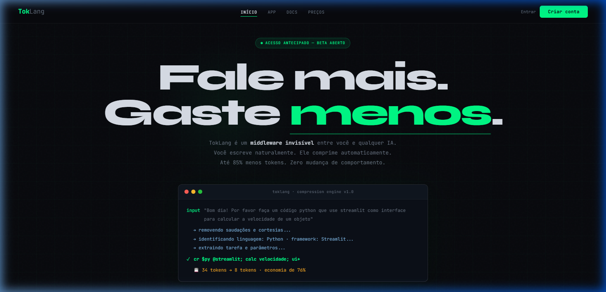

<p align="center">
  
</p>

<p align="center">
  
  
  
  
</p>

<p align="center">
  <code>prompt natural → motor TokLang → até 85% menos tokens → mesma qualidade</code>
</p>

<br>

---

<br>

## O que é TokLang?

TokLang é um **middleware de compressão semântica** que atua como intermediário invisível entre o usuário e qualquer modelo de linguagem — GPT, Claude, Gemini. Você escreve naturalmente; ele comprime automaticamente.

> O usuário nunca vê ou toca na notação comprimida. Ela opera completamente em segundo plano.

<br>

<p align="center">
  
</p>

<br>

---

<br>

## Como funciona

```
┌─────────────────────────────────────────────────────────────────────┐
│                                                                     │
│   ANTES (34 tokens)                                                 │
│   "Bom dia! Por favor faça um código python que use streamlit       │
│    como interface para calcular a velocidade de um objeto"          │
│                                                                     │
│                          ┌──────────┐                               │
│                          │ TokLang  │                               │
│                          │  Engine  │                               │
│                          └────┬─────┘                               │
│                               │                                     │
│                               ▼                                     │
│                                                                     │
│   DEPOIS (8 tokens)                                                 │
│   cr $py @streamlit; calc velocidade; in[dist,t,a]; ui+             │
│                                                                     │
│   ─────────────────────────────────────────────────────             │
│   ▸ economia: 76%  ▸  26 tokens eliminados por chamada              │
│   ▸ em 10K chamadas/dia = ~260K tokens/dia economizados             │
│                                                                     │
└─────────────────────────────────────────────────────────────────────┘
```

### Pipeline completo

```
  ① INPUT          ② COMPRESS         ③ EXPAND           ④ OUTPUT
╭──────────╮    ╭──────────────╮    ╭──────────────╮    ╭──────────╮
│  Prompt  │ ─→ │   Motor      │ ─→ │  Expansor    │ ─→ │  Modelo  │
│  natural │    │   TokLang    │    │  → NL limpo  │    │  de IA   │
╰──────────╯    ╰──────────────╯    ╰──────────────╯    ╰──────────╯
```

<br>

---

<br>

## Gramática TokLang

```
AÇÃO  $LANG  @FRAMEWORK  #ESTRUTURA;  tarefa;  in[params];  modificadores
```

<table>
  <tr>
    <td>

**Ações**
| Token | Significado |
|-------|------------|
| `cr` | Criar |
| `fix` | Corrigir bug |
| `ex` | Explicar |
| `rf` | Refatorar |
| `op` | Otimizar |
| `tst` | Testes |
| `doc` | Documentar |
| `cv` | Converter |

</td>
<td>

**Linguagens** `$`
| Token | Linguagem |
|-------|-----------|
| `$py` | Python |
| `$js` | JavaScript |
| `$ts` | TypeScript |
| `$go` | Go |
| `$rs` | Rust |
| `$sql` | SQL |
| `$sh` | Shell |
| `$java` | Java |

</td>
<td>

**Frameworks** `@`
| Token | Framework |
|-------|-----------|
| `@streamlit` | Streamlit |
| `@fastapi` | FastAPI |
| `@react` | React |
| `@next` | Next.js |
| `@express` | Express |
| `@prisma` | Prisma |
| `@pandas` | Pandas |
| `@jest` | Jest |

</td>
  </tr>
</table>

**Modificadores:** `ui+` visual bonito · `prd` produção · `cm` comentários · `typ` tipagem · `async` assíncrono · `*` máxima qualidade

<br>

---

<br>

## Exemplos reais

```diff
# Exemplo 1 — App Python com UI
- "Bom dia! Por favor faça um código python que use streamlit como interface
-  para ficar bonitinho podendo calcular a velocidade de um objeto"
+ cr $py @streamlit; calc velocidade; in[dist,t,a]; ui+
# 34 tokens → 8 tokens (−76%)

# Exemplo 2 — API REST completa
- "Preciso de uma API REST completa em Node.js com Express para gerenciar
-  usuários, com operações CRUD. Os campos são nome, email e role.
-  Trate os erros 404 e 422. Código pronto para produção."
+ cr $js @express; #api CRUD users; in[name,email,role]; err[404,422]; prd
# 47 tokens → 14 tokens (−71%)

# Exemplo 3 — Explicação didática
- "Você pode me explicar o conceito de closures em JavaScript de forma
-  bem didática? Seria ótimo ter exemplos práticos também"
+ ex $js; closures; dk cm
# 28 tokens → 5 tokens (−82%)
```

<br>

---

<br>

## Executar localmente

```bash
# Clonar
git clone https://github.com/Taiwansz/TokLang.git
cd TokLang

# Iniciar servidor local
python -m http.server 5500

# Abrir no navegador → http://localhost:5500
```

> **Por que um servidor?** O projeto usa `fetch()` para carregar páginas como partials. Navegadores bloqueiam `fetch()` em `file://` por CORS.

<br>

---

<br>

## Estrutura do projeto

```
TokLang/
│
├── index.html                  ← Shell SPA (carrega partials via fetch)
│
├── css/
│   ├── variables.css           ← Design tokens
│   ├── animations.css          ← Keyframes e scroll reveal
│   ├── layout.css              ← Nav, footer, page system
│   ├── components.css          ← Badges, buttons, toasts
│   ├── responsive.css          ← Media queries
│   └── pages/                  ← Estilos por página
│       ├── home.css
│       ├── app.css
│       ├── docs.css
│       ├── pricing.css
│       ├── auth.css
│       └── dashboard.css
│
├── js/
│   ├── router.js               ← SPA router + scroll reveal
│   ├── auth.js                 ← Autenticação e sessão
│   ├── compressor.js           ← Motor de compressão + API
│   ├── dashboard.js            ← Métricas + charts
│   └── init.js                 ← Bootstrap
│
└── pages/                      ← HTML partials
    ├── home.html               ← Landing
    ├── app.html                ← Compressor
    ├── docs.html               ← Documentação
    ├── pricing.html            ← Planos
    ├── login.html              ← Login
    ├── signup.html             ← Cadastro
    ├── forgot.html             ← Recuperar senha
    └── dashboard.html          ← Painel
```

<br>

---

<br>

## Stack

<table>
  <tr>
    <td align="center" width="140">
      <br>
      <sub><b>HTML5</b></sub><br>
      <sub>Semântico</sub>
    </td>
    <td align="center" width="140">
      <br>
      <sub><b>CSS3</b></sub><br>
      <sub>Custom Props · Grid</sub>
    </td>
    <td align="center" width="140">
      <br>
      <sub><b>JavaScript</b></sub><br>
      <sub>ES6+ · Fetch API</sub>
    </td>
    <td align="center" width="140">
      <strong>0</strong><br>
      <sub><b>Dependências</b></sub><br>
      <sub>Zero frameworks</sub>
    </td>
  </tr>
</table>

<br>

---

<br>

## Roadmap

| Status | Feature | Descrição |
|--------|---------|-----------|
| ✅ | Motor de compressão | Compressão semântica via NLP com economia de 65–85% |
| ✅ | Interface web | SPA completa com compressor, docs, pricing e dashboard |
| ✅ | Dashboard analytics | Métricas de uso, histórico e gerenciamento de API keys |
| 🔧 | Backend API | Servidor proxy para chamadas seguras ao modelo |
| 🔧 | Autenticação | JWT + bcrypt + verificação de e-mail |
| 🔧 | Persistência | Prisma + PostgreSQL para dados de usuário |
| 📋 | SDK npm | `npm install toklang` — integração programática |
| 📋 | Extensão de navegador | Compressão automática em ChatGPT, Claude, etc. |
| 📋 | CI/CD | Pipeline de deploy com Vite + testes automatizados |

<br>

---

<br>

<p align="center">
  <sub>Feito com obsessão por tokens</sub><br>
  <sub>MIT © 2026 TokLang</sub>
</p>
