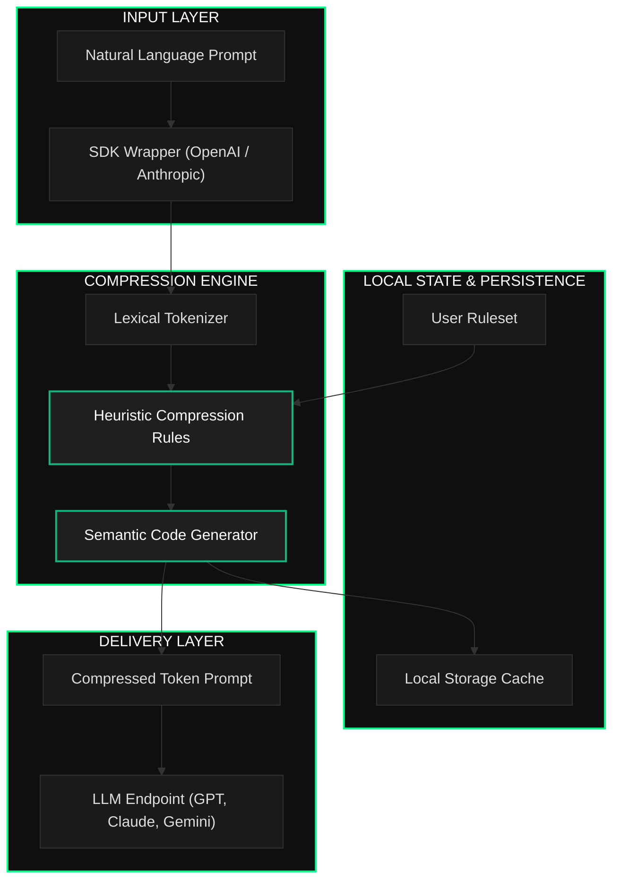

# TokLang

> **The Semantic Prompt Compression Middleware for the AI Era**
> *Reduce LLM token consumption by up to 85% with zero dependencies, zero latency, and absolute privacy.*

---

[]()
[]()
[]()
[](LICENSE)

---

## What is TokLang?

TokLang is a semantic prompt compression middleware designed to run locally with zero latency. It acts as an intermediary layer between human input and Large Language Models, compressing natural language prompts into high-density tokens in real time. 

Where other compression tools rely on external APIs or heavy machine learning models, TokLang uses a lightweight, client-side heuristic engine. It processes prompts in less than 5 milliseconds, preserving full semantic meaning while stripping away redundant linguistic structures.

---

## The Problem TokLang Solves

Modern AI-native applications suffer from token inflation. Natural language prompts are highly redundant, containing up to 80% filler words that do not contribute to the model output. This redundancy increases API costs, limits the context window available for actual data, and increases response latency.

TokLang optimizes this process by applying semantic compression rules at the client level:

| Problem | Consequence | TokLang Solution |
|---------|-------------|------------------|
| **Redundant Language** | High API token consumption and increased bills | Strips grammatical noise to reduce context size by up to 85% |
| **Network Latency** | External compression APIs add hundreds of milliseconds | Local execution engine compiles prompts in under 5ms |
| **Data Leakage** | Sending prompts to third-party compressors compromises privacy | 100% offline client-side compression prevents data exposure |
| **Integration Overhead** | Complex code updates are required to modify prompt pipelines | Transparent middleware wrapper attaches directly to official SDKs |

---

## Architecture Overview

The following diagram illustrates how TokLang processes, compresses, and delivers prompts without external round-trips:



---

## Core Capabilities

TokLang operates through four key modules:

### 1. Lexical Tokenizer
The entry point of the compression engine. It parses natural language inputs, identifies key actions, target programming languages, framework keywords, and extracts parameters.

### 2. Heuristic Rules Engine
The core compiler. It applies semantic compression rules to translate identified keywords into shortcodes. It translates standard verbs like "create an app in Python using Streamlit" into compressed semantic instructions (`cr $py @streamlit`), eliminating grammatical overhead.

### 3. Local Cache Manager
The persistence layer. It stores compression ratios, execution metrics, and history in local storage. This allows users to track token savings and analyze compression performance over time.

### 4. Custom Grammar Compiler
Allows developers to extend TokLang's default vocabulary. You can define custom shortcodes, mapping company-specific frameworks, databases, or API structures to lightweight tokens.

---

## Technology Philosophy

The architecture of TokLang rests on three commitments:

### 1. Zero Dependency Mandate
TokLang is built with vanilla JavaScript. It uses no external frameworks or libraries, keeping the bundle size under 10KB. This ensures it can be integrated into any web app, serverless function, or browser extension without bloated dependencies.

### 2. Client-Side Sovereignty
Data privacy is absolute. The compression engine runs locally in the client browser or application process. No prompts are ever sent to external servers for compression, guaranteeing zero data exposure.

### 3. Latency Minimization
Execution time must be negligible. By utilizing fast heuristic mapping rather than neural networks for prompt reduction, TokLang achieves compression times under 5ms, ensuring it does not become a bottleneck in the application lifecycle.

---

## Repository Structure

```
TokLang/
├── index.html                  # Single Page Application entry point
├── vercel.json                 # Vercel deployment configuration
├── css/                        # Modular style sheets
│   ├── variables.css           # Design tokens and theme colors
│   ├── animations.css          # Keyframes and scroll transitions
│   ├── layout.css              # Structural styles (navigation, footer)
│   ├── components.css          # UI components (buttons, badges)
│   ├── responsive.css          # Mobile responsiveness
│   └── pages/                  # Page-specific styles
│       ├── home.css
│       ├── app.css
│       └── dashboard.css
├── js/                         # Logic files
│   ├── router.js               # Client-side router
│   ├── auth.js                 # Authentication and session state
│   ├── compressor.js           # Core compression engine
│   ├── dashboard.js            # Metrics and statistics charts
│   └── init.js                 # App bootloader
└── pages/                      # HTML templates
    ├── home.html               # Landing page view
    ├── app.html                # Interative compressor view
    ├── docs.html               # Developer documentation
    └── dashboard.html          # Performance analytics view
```

---

## Getting Started

To install and run TokLang locally:

### 1. Clone the repository
```bash
git clone https://github.com/Taiwansz/TokLang.git
cd TokLang
```

### 2. Start a local server
Because TokLang loads HTML pages dynamically using the Fetch API, a local web server is required to avoid CORS blocking on `file://` URLs.
```bash
python -m http.server 5500
```

### 3. Access the application
Open your web browser and navigate to:
```
http://localhost:5500
```

---

## Roadmap

| Milestone | Target | Description |
|-----------|--------|-------------|
| **Core Engine** | Completed | NLP compression engine with 65-85% token reduction |
| **Web Interface** | Completed | SPA with interactive compressor, docs, and dashboard |
| **Analytics Panel** | Completed | Usage charts, savings tracking, and API key management |
| **Backend Proxy** | In Progress | Secure proxy server for routing model requests |
| **Auth System** | In Progress | JWT authentication with email validation |
| **Database Sync** | In Progress | PostgreSQL integration via Prisma |
| **NPM SDK** | Planned | Programmatic integration via `npm install toklang` |
| **Browser Extension** | Planned | Auto-compression extension for ChatGPT, Claude, and Gemini |

---

## Research Foundation

TokLang is built upon concepts in information theory and tokenization optimization:

* **Entropy of Language:** Natural language has high redundancy. Claude Shannon's research indicates that English prose is over 50% redundant, a factor that TokLang exploits to strip syntactic noise.
* **Prompt Engineering Limits:** Modern LLMs allocate attention based on token position and frequency. Compressing prompts increases the density of key directives, improving focus and reducing the likelihood of hallucination on long instructions.

---

## License

Released under the [MIT License](LICENSE).
